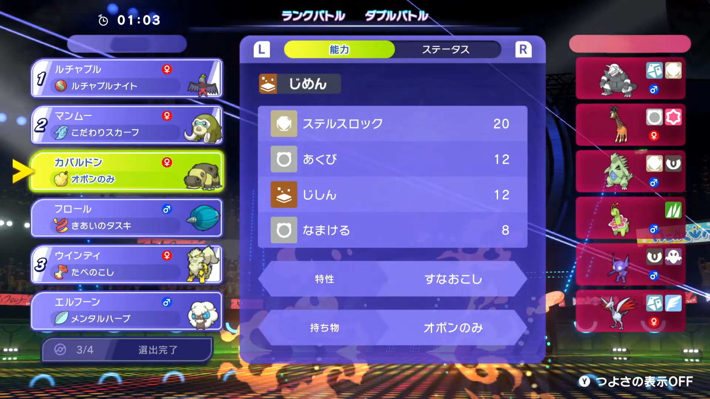

# Pokemon Champions OBS Overlay

An OBS overlay tool for live streaming "Pokemon Champions".  
Press a hotkey on the team selection screen to instantly display the opponent's player name and 6 Pokemon in OBS.

[日本語版はこちら](README_ja.md)

## Features

- Captures the opponent's player name via OCR and displays it as text in OBS
- Captures each of the opponent's 6 Pokemon slots, arranges them horizontally, and sends to OBS
- Single hotkey to capture or clear the overlay

## Requirements

- Windows
- OBS Studio 30.0.0+ (WebSocket enabled)
- Python 3.12+
- Capture card

## Installation

```bash
pip install -r requirements.txt
```

### Dependencies

| Package | Purpose |
|---|---|
| `obsws-python` | OBS WebSocket communication |
| `opencv-python` | Capture card video input and image processing |
| `numpy` | Image array manipulation |
| `Pillow` | PNG image creation with transparency |
| `keyboard` | Global hotkey detection |
| `python-dotenv` | Load OBS password from `.env` file |
| `easyocr` | OCR for opponent trainer name (supports JP/EN/ZH/KO) |

## Setup

### 1. OBS Configuration

- Enable the WebSocket server: Tools → WebSocket Server Settings (port: 4455)
- Create the following sources in OBS:
  - `pokecham_auto-name` — **Text (GDI+)** source, for the opponent's player name
  - `pokecham_auto-poke` — **Image** source, for the opponent's Pokemon lineup

### 2. Find Your Capture Card Device ID

Run the following to list available camera devices:

```bash
python find_camera.py
```

Note the device number that shows your game footage and set `DEVICE_ID` in `config.py`.

To verify the correct device is showing the right image:

```bash
python check_camera.py
```

### 3. Environment Variables

Copy `.env.example` to `.env` and enter your OBS WebSocket password:

```
OBS_PASSWORD=your_password_here
```

Test the connection with:

```bash
python test_connection.py
```

### 4. Coordinate Configuration

> **Note:** If your capture card outputs at 1080p, the default coordinates should work as-is. Changing them unnecessarily may cause misalignment and is not recommended.

Open `config.py` and adjust the coordinates only if your capture resolution differs from 1080p.

```python
DEVICE_ID = 5               # Your capture card device ID

NAME_REGION = (1563, 95, 1845, 141)   # Opponent name area (x1, y1, x2, y2)
POKEMON_REGIONS = [                    # 6 Pokemon slots
    (1603, 156, 1844, 264),
    ...
]
```

Use `coord_picker.py` to visually identify coordinates on the live camera feed:

```bash
python coord_picker.py
```

Click once for the top-left corner, click again for the bottom-right corner.  
Coordinates are printed to the console — copy them into `config.py`.

## Usage

Double-click `start_overlay.bat` to launch.

> **Note:** On first run, EasyOCR will automatically download the OCR model (~100 MB). This only happens once. Startup may take a few seconds while the model loads.

The tool launches in **Double Battle** mode by default.

| Hotkey | Action |
|---|---|
| `F8` | Switch between Single / Double Battle mode |
| `F9` | Capture current frame and send to OBS |
| `F10` | Clear the OBS overlay |
| `Esc` | Exit the tool |

> The current mode is shown in the terminal. Switch to the correct mode before pressing `F9`.

## Example

### Step 1 — Press `F9` on the team selection screen

When the opponent's team appears on the selection screen, press `F9` to capture their name and Pokemon lineup.



> The opponent's 6 Pokemon are listed on the right side of the screen.

### Step 2 — Opponent info is displayed in OBS

The captured data is instantly sent to OBS and shown as an overlay on your stream.


> Top-right: opponent's 6 Pokemon lineup. Top-left: opponent's trainer name (hidden in this example for privacy).  
> The layout is fully customizable in OBS — position and size each source however you like.

### Step 3 — Press `F10` to clear after the battle

When the match ends, press `F10` to remove the overlay from OBS.

## File Structure

```
PokemonChampions-obs-overlay/
├── overlay.py          # Main script
├── config.py           # Coordinates and settings
├── requirements.txt    # Python dependencies
├── start_overlay.bat   # Windows launcher
├── .env.example        # Template for .env
├── find_camera.py      # Find available capture card device IDs
├── check_camera.py     # Preview camera feed for a given device ID
├── coord_picker.py     # Visual coordinate picker tool
└── test_connection.py  # Test OBS WebSocket connection
```

## Notes

- Never commit `.env` to Git — it contains your OBS password
- Coordinates must be adjusted to match your own screen setup
- OBS must be running before launching the tool
